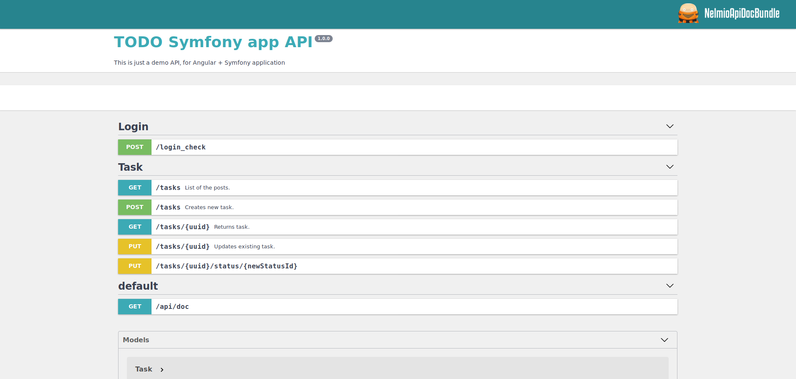

Simple Symfony TODO App
======================
This is just an demo app. It is used to be an API for Angular APP.
------------------------------------------------------------------
 
----

### Stack:
* [Symfony 4](https://symfony.com/)
* [NelmioApiDocBundle](https://symfony.com/doc/current/bundles/NelmioApiDocBundle/index.html)
* [Docker](https://www.docker.com/)
* [Postgres](https://www.postgresql.org/)
* [LexikJWTAuthenticationBundle](https://github.com/lexik/LexikJWTAuthenticationBundle)
* [PHPUnit](https://phpunit.de/) for unit and functional tests
* [TravisCI](https://travis-ci.com/BartoszBartniczak/symfony-todo-app)
* [Coveralls](https://coveralls.io/github/BartoszBartniczak/symfony-todo-app)
* Quality control: 
    * [PHPStan - PHP Static Analysis Tool](https://github.com/phpstan/phpstan)
    * [PHP_CodeSniffer](https://github.com/squizlabs/PHP_CodeSniffer)
    * [PHP-CS-Fixer - PHP Coding Standards Fixer](https://github.com/FriendsOfPHP/PHP-CS-Fixer)
    * [PHP MessDetector](https://phpmd.org/)
    * [PHPCPD - PHP Copy/Paste Detector](https://github.com/sebastianbergmann/phpcpd)
    

### Installation

Run `bin/install` to setup the environment.

### Available commands

All commands are available as shell scripts in `bin` directory.

### API Docs
Docs are available at http://todo-api.test/api/doc

